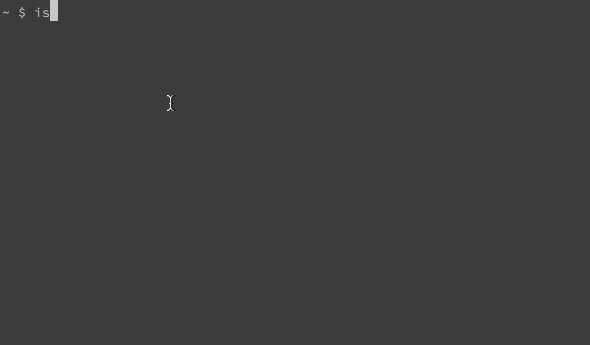

## is-available

To use this, you must specify your [Mashape API key](http://docs.mashape.com/api-keys) in `index.js`. Find all instances of `{your-mashape-key}`.

CLI for checking domain availability through the [Domainr API](https://domainr.com/api).

### Install

`npm install --global is-available`

### Usage

**Check availability**

`isav tearawaytrousers`

- tearawaytrousers.io ✔︎
- tearawaytrousers.com ✖

**Register a domain (opens in default browser)**

`isav tearawaytrousers.io -r`

Opening browser to register tearawaytrousers.io

### License

MIT [http://rmlewisuk.mit-license.org/](http://rmlewisuk.mit-license.org/)

